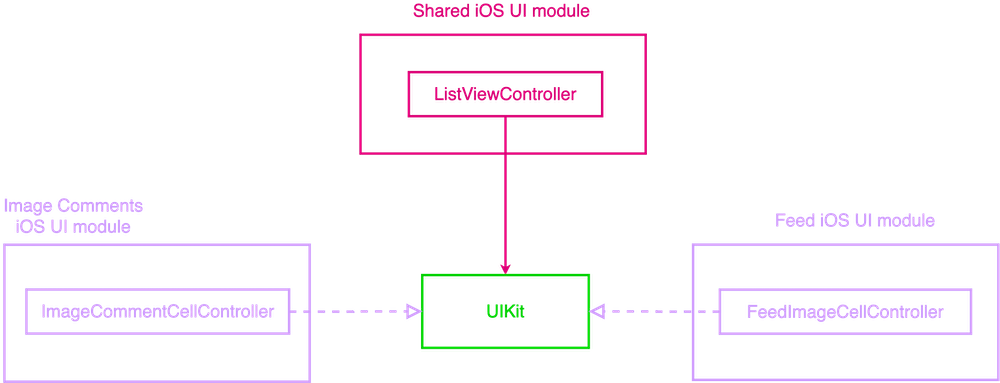

#  Essential Feed iOS Application

  

## App Architecture

## Architecture 

### Business Logic (loaders)

The `FeedLoader` protocol doesn't exists anymore, we reject dependencies. Now, our architecture for business logic looks like this:

### Presentation

We are reusing the presentation for both `Feed` and `Image Comments`

## UI

We are reusing the same table view to display the feed and comments

## Snapshot Testing

**Please make sure use an `iPhone 12 Mini` simulator to run the snapshot tests. Otherwise tests will fail.**

## App Requirements

[BDD Specs](./docs/BDD_specs.md)

[Model Specs](./docs/model_specs.md)

[Feed Use Cases](./docs/use_cases.md)

[Feed Image Use Cases](./docs/feed_image_use_cases.md)

---
